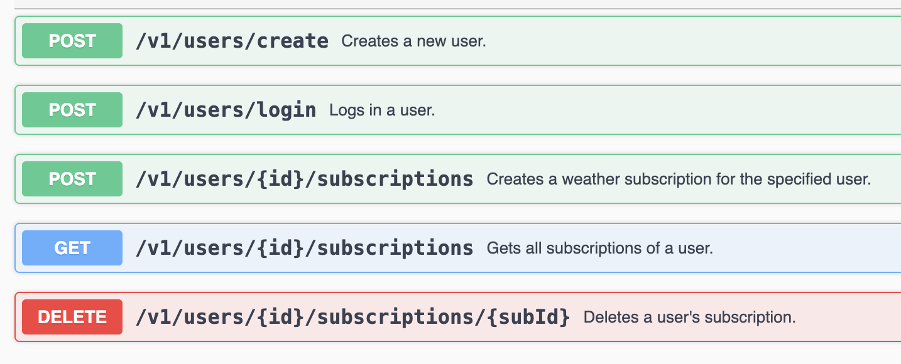

# Weather API

A simple ASP.NET Core Web API that integrates with the OpenWeatherMap API to provide weather-based subscription services.

## Hosted in Azure (Web App)

https://weather-api-v5-gtcuhfhgfudwf2h7.westeurope-01.azurewebsites.net/swagger/index.html

## Use Cases

After creating an account or logging in, use the **`userId`** to:

- **Create** weather subscriptions
- **Retrieve** all subscriptions for a specific **`userId`**
- **Delete** a specific subscription using both **`userId`** and **`subId`**

## Good to know

- Only English is supported for country and city names.
- **Each user can have up to 5 weather subscriptions.**
- The application is running with ASPNETCORE_ENVIRONMENT=Development, so be careful — you might see detailed stack traces. :)

## Tech description

- .NET 8
- ASP.NET Core Web API
- OpenWeatherMap API
- GitHub Action (CI, CD)
